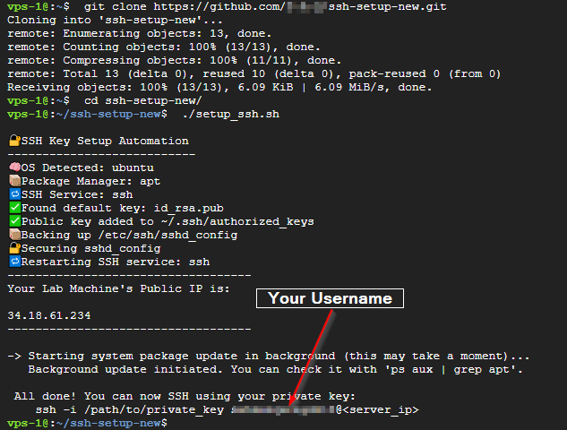

# 🚀 SSH Key Setup Automation Script

This script automates the setup of SSH key-based authentication across multiple Linux distributions. It's perfect for:

- Quickly setting up new **lab machines**
- Hardening servers by **disabling password logins**
- Allowing remote login without needing to manually edit SSH configs

---

## 📦 Features

- Works on **Debian, Ubuntu, Fedora, Arch, Rocky, AlmaLinux**, and more
- Accepts your public key via:
  - A `.pub` file (e.g., `id_rsa.pub`)
  - Manual input (paste directly)
- Backs up your existing SSH configuration
- Automatically modifies `sshd_config` for best security
- Restarts the correct SSH service (depending on OS)
- Runs system updates in the background

---

##  Usage


## 🔑 SSH Key Generation

Before running this script, you need a valid SSH key pair (private + public key).  
If your public key is in the wrong format, the server will reject it with:

    Permission denied (publickey)

Below are two recommended ways to generate keys.

---

### **Method 1 — Using MobaXterm (Windows)**

> Recommended if you are on Windows and already use MobaXterm for SSH.

1. Open **MobaXterm** → **Tools** → **MobaKeyGen**.
2. Click **Generate** (default type is RSA, which works fine).
3. Move your mouse around the blank area until the progress bar completes.
4. **IMPORTANT FIX for Common Issue**  
   - You will see the **public key** appear in the large text box at the top.  
   - **Manually copy this text** and save it into a file (e.g., `id_rsa.pub`).  
   - **Do NOT** use the auto-downloaded `.pub` file that comes with the private key — it can be in the wrong format and cause authentication errors.
5. Save your **private key** in a safe location.
   - If using OpenSSH: you'll have `id_rsa` (private) and `id_rsa.pub` (public).
   - If using MobaXterm/PuTTY: you'll have `.ppk` (private) and a manually copied OpenSSH-format public key.


---

### **Method 2 — Using OpenSSH (Linux/Mac/WSL)**

If you are on Linux, macOS, or Windows with WSL, you can use:

    ssh-keygen -t rsa -b 4096 -C "your_email@example.com"

- Press **Enter** to accept the default file location (`~/.ssh/id_rsa`).
- Enter a passphrase (optional, adds extra security).
- Your public key will be saved as `~/.ssh/id_rsa.pub` (correct format for OpenSSH).
- Your private key will be saved as `~/.ssh/id_rsa`.

---

### ✅ Quick Verification

To check if your public key is in the right format, run:

    cat id_rsa.pub

It should start with:

    ssh-rsa AAAAB3...

---

**Why This Matters:**  
If the public key is in the wrong format (like PuTTY format), Linux SSH servers will not match it to your private key, resulting in **Permission denied (publickey)** errors.


---

Now that you have a valid public/private key pair, you can use one of the two setup options below.


###  Option 1: Fork and Replace Key

1. **Fork this repo** into your GitHub account.
2. In your fork, open the `id_rsa.pub` file and replace its contents with **your public key**.
   - **If using MobaXterm (Windows)**: Use the manually copied public key from the large text box in MobaKeyGen (Step 4 of [Method 1](#method-1--using-mobaxterm-windows) in SSH Key Generation) 
     **Do NOT** use the `.pub` file downloaded alongside your private key — it may be in the wrong format and cause authentication errors.
   - **If using OpenSSH**: Copy the contents of your `id_rsa.pub` file (usually in `~/.ssh/id_rsa.pub`) into the one in your fork.

3. On your target Linux machine:

```
git clone https://github.com/YourUsername/ssh-key-auto-setup.git
```
```
cd ssh-key-auto-setup
bash setup_ssh.sh
```

### Option 2: Clone & Provide Key Path or Paste It
Clone the repo:
```
git clone https://github.com/YourUsername/ssh-key-auto-setup.git
cd ssh-key-auto-setup
```
Run the script and follow the prompt:
```
bash setup_ssh.sh /path/to/key
```
You can:

Provide a path to your .pub key (e.g., /home/user/.ssh/id_rsa.pub)

Or paste your key directly when prompted





<br><br>
## 🧠 Why Two Modes?

This script works in **two flexible ways**:

### **🅰️ Fork & Push Your Key**

> Best when you **cannot transfer files** to your server.

🅱️ Direct Clone & Pass Key
Best when you can move your key to the server.


<br><br>
### What this script Does
Adds your key to ~/.ssh/authorized_keys

Updates /etc/ssh/sshd_config to:

Disable PasswordAuthentication

Enable PubkeyAuthentication

Set PermitRootLogin prohibit-password

Backs up existing sshd_config

Restarts the appropriate SSH service based on detected OS

Starts a silent apt, dnf, or pacman update in the background

Shows your public IP address at the end for easy connection
<br><br>
### 🛑 Warnings
Never share your private key

Make sure key-based login works before locking down password access

You need sudo access to modify SSH and restart services

Example SSH Login
```
ssh -i ~/.ssh/your_private_key username@your_public_ip
```

### 💡 Contribute or Fork
Feel free to fork, modify, or suggest improvements!
